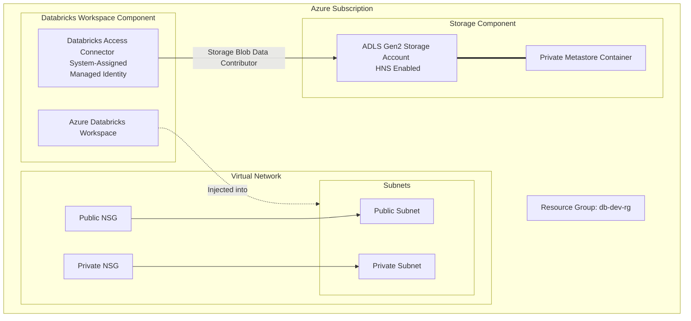

# Azure Databricks Multi-Workspace Platform Provisioning with Unity Catalog

This repository contains a modular, production-ready Terraform project designed to automate the deployment, networking, and security of multi-workspace **Azure Databricks** platforms integrated with **Unity Catalog**. 

By leveraging Terraform's dynamic capabilities (`for_each`), this project allows platform and data engineering teams to deploy multiple isolated or connected Databricks workspaces (e.g., `analytics`, `data-science`, `engineering`) under a unified security, identity, and networking framework.

---

## 🏗️ High-Level Architecture

The platform architecture implements enterprise-grade best practices for secure cloud deployments:

1. **VNet Injection (Secure Cluster Connectivity)**: Each Databricks workspace is injected into a custom Virtual Network (VNet) with isolated public and private subnets. **Secure Cluster Connectivity (No Public IP)** is configured, ensuring that compute clusters have no open public inbound ports and access the control plane securely.
2. **Unified Data Governance (Unity Catalog)**: 
   - An isolated **Azure Data Lake Storage Gen2 (ADLS Gen2)** account with a Hierarchical Namespace (HNS) is provisioned per workspace for the Unity Catalog metastore.
   - An **Azure Databricks Access Connector** is deployed alongside each workspace with a System-Assigned Managed Identity.
   - Secure keyless access is established by assigning the **Storage Blob Data Contributor** role to the Access Connector's principal ID at the storage account level.



---

## 📁 Repository Directory Structure

The repository is structured following standard Terraform patterns, separating reusable, environment-agnostic infrastructure blueprints (**Modules**) from specific deployment instantiations (**Environments**):

```text
├── .github/
│   └── workflows/
│       └── pipeline.yml       # Automated GitHub Actions CI/CD Pipeline
├── env/
│   └── dev/
│       ├── .terraform.lock.hcl
│       ├── main.tf            # Dev environment orchestration & module instantiation
│       ├── provider.tf        # Providers config & Remote State Backend (Azure Storage)
│       ├── terraform.tfvars   # Input values for variables
│       └── variables.tf       # Root-level variable definitions
├── modules/
│   ├── databricks_workspace/  # Azure Databricks workspace & Access Connector provisioning
│   ├── metastore_storage/     # Storage Accounts (ADLS Gen2) & containers for Unity Catalog
│   ├── network/               # Virtual Network and subnets with Databricks delegations
│   ├── ngs/                   # Network Security Groups (NSGs) for subnets
│   ├── role_assignment/       # IAM role bindings for Managed Identity keyless storage access
│   └── subnet_nsg_assoc/      # Binding of Subnets to NSGs
├── .gitignore
└── README.md                  # This file
```

---

## 🛠️ Deep-Dive into Terraform Modules

### 1. `network`
- **Location**: [modules/network](file:///d:/Projects/databrick_terraform/databricks_workspace/modules/network)
- **Description**: Creates the Virtual Network (VNet) and two subnets (public and private).
- **Subnet Delegations**: Applies a delegation to `Microsoft.Databricks/workspaces` on both subnets. This delegation permits the Azure Databricks service to perform specific network actions (e.g., preparing network policies) in the customer's subnets.

### 2. `ngs`
- **Location**: [modules/ngs](file:///d:/Projects/databrick_terraform/databricks_workspace/modules/ngs)
- **Description**: Deploys Network Security Groups (NSGs) to govern and secure traffic entering and exiting the Databricks node subnets.

### 3. `subnet_nsg_assoc`
- **Location**: [modules/subnet_nsg_assoc](file:///d:/Projects/databrick_terraform/databricks_workspace/modules/subnet_nsg_assoc)
- **Description**: Binds the public and private subnets created by the `network` module to their respective NSGs created by the `ngs` module.

### 4. `databricks_workspace`
- **Location**: [modules/databricks_workspace](file:///d:/Projects/databrick_terraform/databricks_workspace/modules/databricks_workspace)
- **Description**: 
  - Provisions the `azurerm_databricks_workspace` using custom parameters mapping to the injected VNets and subnets. 
  - Sets `no_public_ip = true` to enable Secure Cluster Connectivity.
  - Provisions the `azurerm_databricks_access_connector` with a `SystemAssigned` identity to bridge Databricks Unity Catalog and Azure storage securely.

### 5. `metastore_storage`
- **Location**: [modules/metastore_storage](file:///d:/Projects/databrick_terraform/databricks_workspace/modules/metastore_storage)
- **Description**: Provisions an ADLS Gen2 Storage Account with hierarchical namespace enabled (`is_hns_enabled = true`). Creates a private storage container (`unity-catalog-metastore`) to act as the root storage for a Unity Catalog metastore. A random suffix is appended to the storage account name to satisfy Azure's global uniqueness constraint.

### 6. `role_assignment`
- **Location**: [modules/role_assignment](file:///d:/Projects/databrick_terraform/databricks_workspace/modules/role_assignment)
- **Description**: Grants the Databricks Access Connector's principal ID the **Storage Blob Data Contributor** role on the storage account scope, allowing secure read/write capabilities without persisting access keys.

---

## ⚙️ Configuration & Variables

Deployments are highly configurable via `env/dev/variables.tf` and parameterized using `env/dev/terraform.tfvars`.

### Main Workspace Map Configuration
Workspaces are declared as a map of objects, allowing seamless scaling:

```hcl
variable "workspaces" {
  type = map(object({
    vnet_cidr           = string
    public_subnet_cidr  = string
    private_subnet_cidr = string
    sku                 = optional(string, "premium")
  }))
}
```

### Example `terraform.tfvars`
```hcl
prefix   = "db-dev"
location = "eastus"

workspaces = {
  "analytics" = {
    vnet_cidr           = "10.1.0.0/16"
    public_subnet_cidr  = "10.1.1.0/24"
    private_subnet_cidr = "10.1.2.0/24"
    sku                 = "trial"
  }
}

tags = {
  Environment = "Development"
  Owner       = "DataEngineers"
  ManagedBy   = "Terraform"
  Project     = "DataPlatform"
}
```

To add another workspace (e.g., `data-science`), simply expand the map:
```hcl
workspaces = {
  "analytics" = {
    vnet_cidr           = "10.1.0.0/16"
    public_subnet_cidr  = "10.1.1.0/24"
    private_subnet_cidr = "10.1.2.0/24"
    sku                 = "premium"
  },
  "data-science" = {
    vnet_cidr           = "10.2.0.0/16"
    public_subnet_cidr  = "10.2.1.0/24"
    private_subnet_cidr = "10.2.2.0/24"
    sku                 = "premium"
  }
}
```

---

## 🚀 Getting Started

### Prerequisites
1. **Terraform**: Version `1.3.0` or higher installed locally.
2. **Azure CLI**: Logged in and set to the target subscription.
   ```bash
   az login
   az account set --subscription "<subscription_id>"
   ```
3. **Azure Backend Access**: Ensure the backend storage account `githubbackend1234` and container `backend` inside resource group `github-backend` exist, or modify `env/dev/provider.tf` to point to your target remote state storage.

### Local Deployment Steps
1. Navigate to the Dev environment folder:
   ```bash
   cd env/dev
   ```
2. Initialize Terraform and fetch providers & modules:
   ```bash
   terraform init
   ```
3. Generate and inspect the execution plan:
   ```bash
   terraform plan
   ```
4. Apply the configuration to deploy the infrastructure:
   ```bash
   terraform apply
   ```

---

## 🤖 CI/CD Integration (GitHub Actions)

This project has an integrated automation workflow defined in `.github/workflows/pipeline.yml`. 

### Pipeline Overview
- **Trigger**: Runs on every `push` to the `main` branch.
- **Runner**: Executes on a `self-hosted` runner.
- **Authentication**: Authenticates securely via OpenID Connect (OIDC) / Azure Login using system identities (`client-id`, `tenant-id`, `subscription-id`).
- **Steps Executed**:
  1. Sets up Terraform (v1.8.5).
  2. Checks out the code repository.
  3. Logins to Azure using Azure Login action.
  4. Runs `terraform init` inside `env/dev/`.
  5. Performs a dry run via `terraform plan`.
  6. Executes `terraform destroy --auto-approve` (Note: Currently set up for ephemeral verification/testing in Sandbox environments to avoid recurring costs. In a production branch, replace the `destroy` action with a `terraform apply --auto-approve` block).

---

## 🔒 Security Best Practices Implemented
- **No Access Keys**: All data plane interactions use Azure Managed Identities and Azure Active Directory (AAD) RBAC rather than access keys or SAS tokens.
- **Network Isolation**: By deploying within secure cluster connectivity environments, node-to-node communications are kept completely private.
- **State File Isolation**: State files are managed in remote, encrypted Azure Blob storage (`azurerm` backend) to prevent local storage leakage of sensitive data.
- **Resource Tagging**: Complete and consistent resource tagging ensures accurate cost tracing and environment governance.
